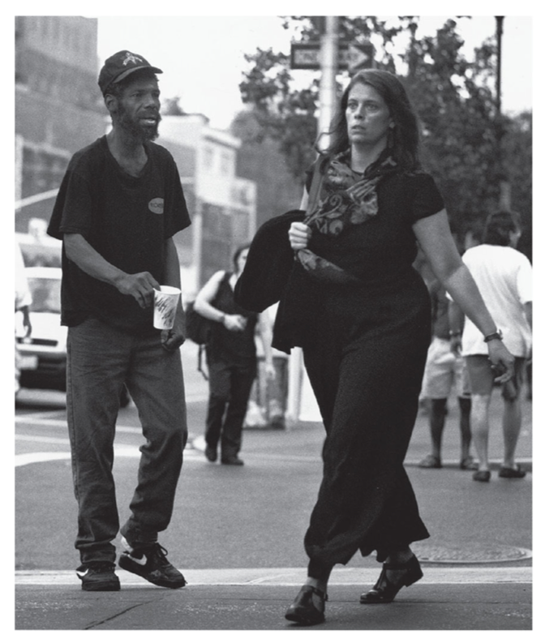

### Social Interaction
SOC100: Introduction to Sociology  
Brian McPhail  
Purdue University
---

1.	**Professional Settings**
2.	**With Friends**
3.	**Social Media**
4.	**Important but Personal Settings**

*How you behave and interact with others in each situation?*

- What words do you use/not use?
- How do you look (dress, posture)?
- What non-verbal gestures do you do?
- What topics do you discuss/avoid?

---
@snap[west]
**Impression management**: preparing for the presentation of one’s social role  

@ul
  - Process by which people attempt to present a favorable public image of themselves
  - Why? To compel others to react to them in ways they wish
@ulend
@snapend

---
@snap[west span-90]
A **role** is a set of expectations about how people are supposed to behave given the status or social position that they occupy.
 
 
Audience segregation
@snapend
---

---
@snap[west]
**Civil inattention** is the process whereby strangers who are in close proximity demonstrate that they are aware of one another, without imposing on each other.
@snapend

---

@snap[midpoint span-50]

@snapend

@snap[south span-100]
@size[smaller](Mitchell Duneier and Harvey Molotch (1999))
@snapend
---
